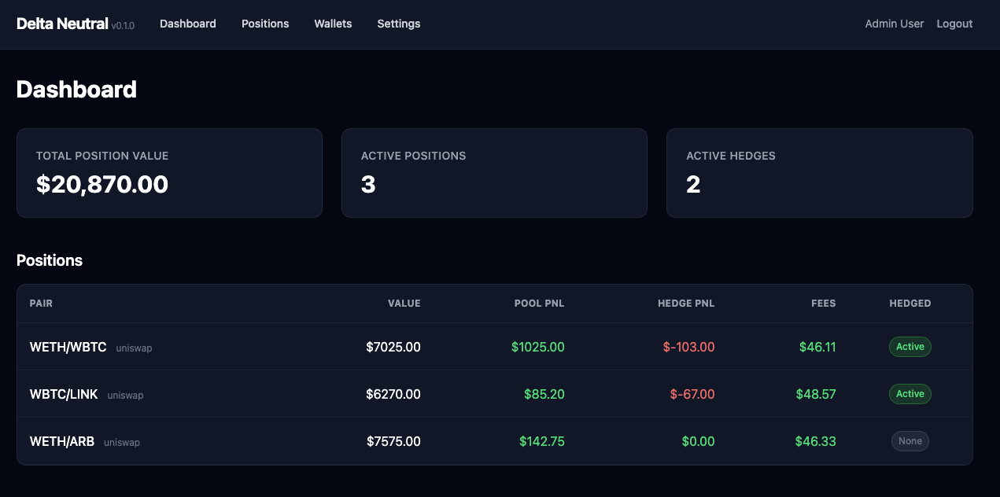
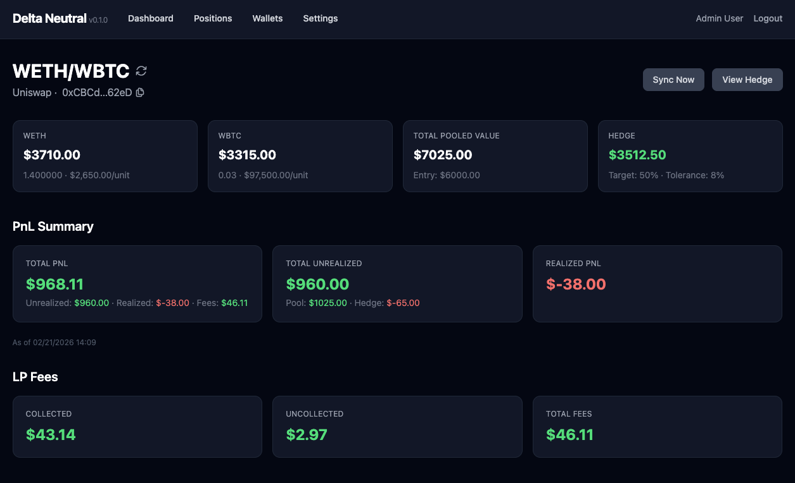

# Delta Neutral

Self-hosted delta-neutral hedging automation for Uniswap V3 concentrated liquidity positions. Monitors your CLPs and automatically rebalances short hedges on Hyperliquid to maintain a target hedge percentage within a configurable tolerance band.

---





## How It Works

1. (Safely) deploy the app with a Hyperliquid private key
2. Paste a wallet address with Uniswap V3 positions
3. Create a hedge with a target percentage (e.g. 50%) and tolerance (e.g. 10%)
4. The app continuously monitors your pool amounts and opens/closes shorts on Hyperliquid to keep the hedge within tolerance
5. If the position moves out of range and an asset drops to zero, the short for that asset is automatically closed while the other asset's hedge continues

Each asset in a pair is hedged independently, allowing for asymmetric movements. PnL is tracked over time.

## Features

- **Automated Rebalancing** - Background jobs check positions every 5 minutes and rebalance shorts when deviation exceeds tolerance
- **Per-Asset Independence** - The two assets in a position are hedged separately
- **Subaccount Isolation** - When multiple hedges share the same asset, Hyperliquid subaccounts provide per-hedge isolation (max 10 subaccounts = up to 12 positions sharing the same hedged asset)
- **PnL Tracking** - Realized and unrealized P&L captured from Hyperliquid fill data
- **Email Notifications** - Sent on every hedge rebalance with before/after short sizes
- **Failed Rebalance Visibility** - Failed rebalances are recorded with error details and shown in the UI; consecutive failures (3 within 24h) trigger a circuit breaker to stop retrying
- **Job Dashboard** - Solid Queue admin UI at `/jobs` for inspecting queues, retrying failed jobs, and monitoring background work
- **Dashboard** - Real-time portfolio overview with active positions, hedges, and rebalance history
- **Multi-Network** - Supports wallets on Ethereum, Arbitrum, Base, Optimism, and Polygon

## Prerequisites

- **Ruby 3.4.8** 
- A [Hyperliquid](https://hyperliquid.xyz) account with API credentials
- A [The Graph](https://thegraph.com) API key - used for Uniswap data
- EVM RPC endpoints (e.g. [Alchemy](https://www.alchemy.com) or [Infura](https://www.infura.io)) for Ethereum, Arbitrum, and Base - used for on-chain fee reads
- SMTP credentials for email notifications

## Setup

```bash
git clone https://github.com/carter2099/delta_neutral.git
cd delta_neutral

bundle install
bin/rails db:prepare
bin/rails db:seed
```

Copy the example environment file and fill in your credentials:

```bash
cp .env.example .env
```

### Environment Variables

```env
# Hyperliquid
HYPERLIQUID_PRIVATE_KEY=
HYPERLIQUID_WALLET_ADDRESS=
HYPERLIQUID_TESTNET=true          # Set to false for mainnet

# Uniswap / The Graph
UNISWAP_SUBGRAPH_URL=https://gateway.thegraph.com/api/subgraphs/id/5zvR82QoaXYFyDEKLZ9t6v9adgnptxYpKpSbxtgVENFV
THEGRAPH_API_KEY=

# Ethereum RPC (per-network, e.g. Alchemy)
ETHEREUM_RPC_URL=
ARBITRUM_RPC_URL=
BASE_RPC_URL=

# SMTP 
SMTP_ADDRESS=smtp.gmail.com
SMTP_PORT=587
SMTP_USERNAME=
SMTP_PASSWORD=
SMTP_DOMAIN=
SMTP_AUTHENTICATION=plain
SMTP_ENABLE_STARTTLS=true
```

Start the development server:

```bash
bin/dev
```

This starts the Rails server, Solid Queue background jobs, and Tailwind CSS watcher. Access the app at `http://localhost:3000`.

Default dev login: `admin@example.com` / `password123`

## Deployment

Production deployment uses Docker Compose. Create a `.env.production` file with your credentials (see `.env.example`), then:

```bash
docker compose -f docker-compose.prod.yml up -d --build
```

The app will be available on port `43080`. The SQLite database is bind-mounted from `./storage` so data persists across container restarts.

To rebuild after pulling changes:

```bash
docker compose -f docker-compose.prod.yml up -d --build
```

## Production Notes

- Start with `HYPERLIQUID_TESTNET=true` to validate your setup before trading with real funds
- The SQLite database is stored in `storage/` - back this up regularly
- Set up SSL/TLS for secure credential handling
- Store API keys securely and never commit them to git

## Development

Make changes, then validate with lint + tests:

```bash
bin/rake    # Runs RuboCop and the full test suite
```

Both must pass before committing. To open a PR:

```bash
git checkout -b my-feature
# make changes, commit
git push -u origin my-feature
gh pr create
```

## License

MIT
